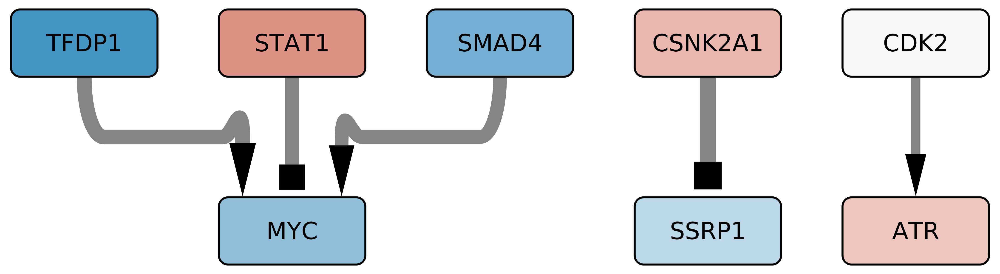
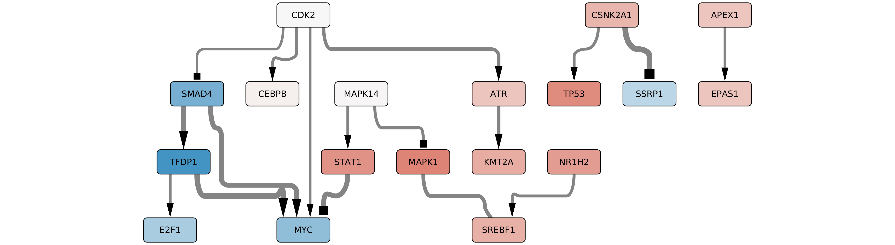
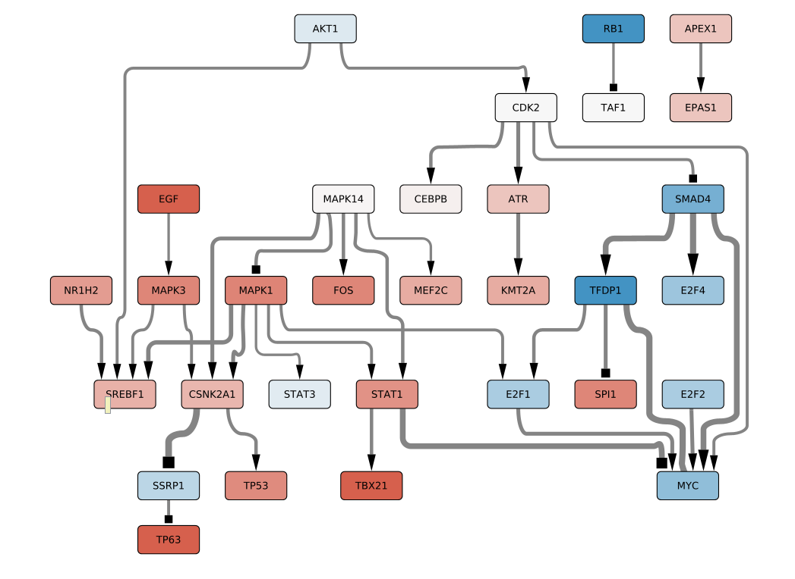

```{r setup, include=FALSE}
knitr::opts_chunk$set(echo = TRUE)
```

### License Info

This program is free software: you can redistribute it and/or modify it under 
the terms of the GNU General Public License as published by the Free Software 
Foundation, either version 3 of the License, or (at your option) any later 
version.

This program is distributed in the hope that it will be useful, but WITHOUT ANY 
WARRANTY; without even the implied warranty of MERCHANTABILITY or FITNESS FOR 
A PARTICULAR PURPOSE. See the GNU General Public License for more details.

Please check http://www.gnu.org/licenses/.

## Introduction

The present script takes the CARNIVAL outputs generated from drug signatures 
with anti SARS-CoV-2 infection effect and compare them. 

### Getting Ready 

We first load the required libraries. 

```{r libraries, message=FALSE, warning=FALSE}
library(tidyverse)
library(ggplot2)
library(corpustools)
library(igraph)
```

## Results 

To first explore the similarity between CARNIVAL results on  drug signatures, 
we are going to compute the Jaccard index for the shared nodes and interactions 
in the output networks for every drug. 

```{r match_nodes_edges}
path_drug <-"CARNIVAL_results/drug_signatures/"

drugs_selected <- c("alprostadil", "amuvatinib","astemizole","azithromycin",
  "ciclesonide", "clemastine","clomifene", "dapivirine", "dronedarone",
  "fluspirilene", "lonafarnib","loperamide","niclosamide","osimertinib",
  "papaverine", "promethazine", "regorafenib","thioridazine","toremifene")

files_drug_signatures <- 
  paste0(path_drug, "carnival_results_", drugs_selected, ".rds")
  
len_drugs <- length(files_drug_signatures)
len_df <- len_drugs*len_drugs

results_df <- 
  data.frame(
    drug1 = character(length = len_df), 
    drug2 = character(length = len_df), 
    jaccard_nodes = numeric(length = len_df),
    jaccard_interactions = numeric(length = len_df),
    common_nodes = character(length = len_df),
    common_interactions = character(length = len_df))

a <- 1


for (i in seq_along(drugs_selected)){
  current_drug_1 <- drugs_selected[i]
  curent_file_drug_1 <- readRDS(files_drug_signatures[i])
  current_network_drug_1 <- curent_file_drug_1$weightedSIF %>% 
    dplyr::as_data_frame() %>% dplyr::distinct(Node1, Sign, Node2)
  current_nodes_drug_1 <- current_network_drug_1 %>% 
    dplyr::pull(Node1, Node2) %>% 
    unique()
  for (j in seq_along(drugs_selected)){
    current_drug_2 <- drugs_selected[j]
    curent_file_drug_2 <- readRDS(files_drug_signatures[j])
    current_network_drug_2 <- curent_file_drug_2$weightedSIF %>% 
      dplyr::as_data_frame() %>% dplyr::distinct(Node1, Sign, Node2)
    current_nodes_drug_2 <- current_network_drug_2 %>% 
      dplyr::pull(Node1, Node2) %>% 
      unique()
    common_nodes <- unique(intersect(current_nodes_drug_1, current_nodes_drug_2))
    union_nodes <- unique(c(current_nodes_drug_1, current_nodes_drug_2))
    common_interactions <- 
      dplyr::semi_join(current_network_drug_1, current_network_drug_2, 
                        by = c("Node1", "Sign", "Node2"))
    union_interactions <- 
      rbind.data.frame(current_network_drug_1, current_network_drug_2) %>%
      dplyr::distinct(Node1, Sign, Node2)
    jaccard_nodes <- length(common_nodes)/ length(union_nodes)
    jaccard_interactions <- nrow(common_interactions)/nrow(union_interactions)
    results_df$drug1[a] <- current_drug_1
    results_df$drug2[a] <- current_drug_2
    results_df$jaccard_nodes[a] <- jaccard_nodes
    results_df$jaccard_interactions[a] <- jaccard_interactions
    results_df$common_nodes[a] <- paste0(common_nodes, collapse = " ; ")
    results_df$common_interactions[a] <- common_interactions %>% 
      dplyr::mutate(inter = paste0(Node1, "  ", Sign, "  ", Node2)) %>% 
      dplyr::pull(inter) %>% paste0(collapse = " ; ")
    a <- a + 1
  }
}
```


### Jaccard Index at the node level

Then, we plot the results at the node level

```{r node_Jaccard}
sim_nodes <- 
  ggplot(results_df, aes(drug1, drug2)) +
  geom_tile(aes(fill=jaccard_nodes), colour = "white") +
  scale_fill_gradient(low = "#b7f7ff", high = "#0092a3") + 
  theme_minimal() + 
  theme(axis.ticks = element_blank(),
        axis.text.x = element_text(size = 8,
        angle = 90))
```

```{r fig_nodes_jaccard,dpi=300,echo=FALSE,fig.height=10, fig.width=10}
sim_nodes
```

### Jaccard Index at the interaction level

And then at the interaction level. 

```{r interactions_Jaccard}
sim_interactions <- 
  ggplot(results_df, aes(drug1, drug2)) +
  geom_tile(aes(fill=jaccard_interactions), colour = "white") +
  scale_fill_gradient(low = "#b7f7ff", high = "#0092a3") + 
  theme_minimal() + 
  theme(axis.ticks = element_blank(),
        axis.text.x = element_text(size = 8,
                                   angle = 90))
```

```{r fig_interactions_Jaccard,dpi=300,echo=FALSE,fig.height=10, fig.width=10}
sim_interactions
```

### Extracting the core network 

We merge together all the carnival output networks for every drug with anti 
SARS-CoV-2 effect. In addition, we weight the edges (interactions) according 
to the number of appearances in the different networks. 

```{r global_network}
final_network <- tibble()
final_activity <- tibble()

for (i in seq_along(drugs_selected)){
  current_drug_1 <- drugs_selected[i]
  curent_file_drug_1 <- readRDS(files_drug_signatures[i])
  current_activity <- curent_file_drug_1$nodesAttributes %>%
    as.data.frame() %>% 
    dplyr::select(Node, AvgAct)
  final_activity <- rbind.data.frame(final_activity, current_activity)    
  current_network_drug_1 <- curent_file_drug_1$weightedSIF %>% 
    dplyr::as_data_frame() %>% dplyr::distinct(Node1, Sign, Node2)
  final_network <- rbind.data.frame(final_network, current_network_drug_1)
}

final_activity_mean <- final_activity %>%
  dplyr::mutate(AvgAct = as.numeric(AvgAct)) %>%
  dplyr::filter(AvgAct != 0) %>%
  dplyr::group_by(Node) %>%
  dplyr::summarise(AvgAct = mean(AvgAct)) 
  

final_network_weigths <- final_network %>% 
  dplyr::count(Node1, Sign, Node2) %>%
  dplyr::rename(weight = "n") %>%
  dplyr::select(Node1, Node2, weight, Sign) %>%
  graph_from_data_frame(directed = TRUE)

```

Then, we extract the core network for different thresholds as described in 
Serrano, M. A., Boguna, M., & Vespignani, A. (2009). Extracting the 
multiscale backbone of complex weighted networks. Proceedings of the National 
Academy of Sciences, 106(16), 6483-6488.


#### Core Network alpha 0.01


```{r core_network_001}
gb_001 = backbone_filter(final_network_weigths, alpha = 0.01)

gb_001_df <- igraph::as_data_frame(gb_001)

final_activity_mean_attr_001 <- final_activity_mean %>% 
  dplyr::filter(Node %in% V(gb_001)$name)

write_delim(gb_001_df, path = "backbone_networks/gb_001_df.txt")

write_tsv(final_activity_mean_attr_001, 
          path = "backbone_networks/gb_001_attri.txt")
```

<br><br>

<br><br>

#### Core Network alpha 0.05

```{r core_network_005}
gb_005 = backbone_filter(final_network_weigths, alpha = 0.05) 

gb_005_df <- igraph::as_data_frame(gb_005)

final_activity_mean_attr_005 <- final_activity_mean %>% 
  dplyr::filter(Node %in% V(gb_005)$name)

write_delim(gb_005_df, path = "backbone_networks/gb_005_df.txt")

write_tsv(final_activity_mean_attr_005, 
  path = "backbone_networks/gb_005_attri.txt")
```


<br><br>

<br><br>


#### Core Network alpha 0.1

```{r core_network_01}
gb_01 = backbone_filter(final_network_weigths, alpha = 0.1)

gb_01_df <- igraph::as_data_frame(gb_01)

final_activity_mean_attr_01 <- final_activity_mean %>% 
  dplyr::filter(Node %in% V(gb_01)$name)

write_delim(gb_01_df, path = "backbone_networks/gb_01_df.txt")

write_tsv(final_activity_mean_attr_01, 
          path = "backbone_networks/gb_01_attri.txt")
```

<br><br>

<br><br>


## Session Info Details

```{r, echo=FALSE, eval=TRUE}
sessionInfo()
``````
